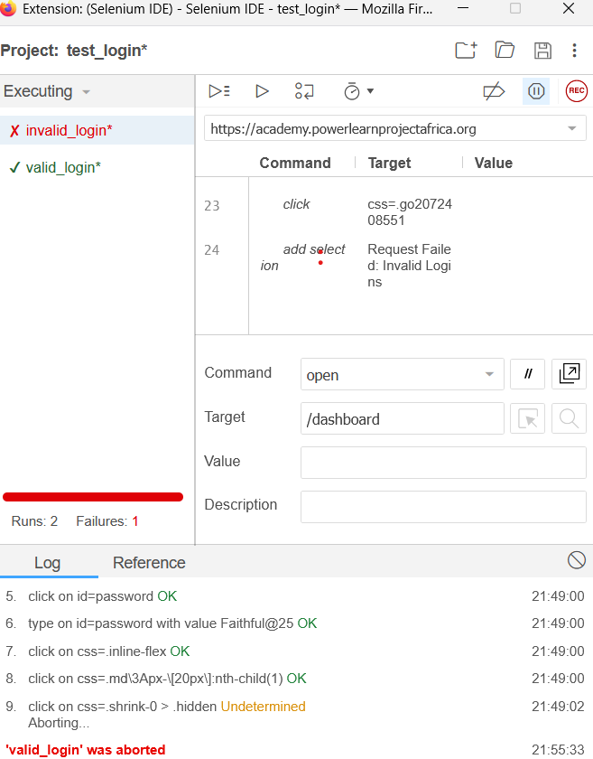

Login Test Summary

The login_test suite runs on the base URL https://academy.powerlearnprojectafrica.org and contains two scenarios: one for successful login and one for handling invalid credentials.

1. ✅ Test Case: Valid Login (valid_login)
This test verifies that a user with the correct credentials can successfully sign in to the application and reach the protected area.

Pre-conditions
The login page is accessible.

A valid user account exists with the email mwituwajc@gmail.com and password *****88@25.

Test Steps

Navigate to the login path (/login).

Enter the valid email mwituwajc@gmail.com into the email input field (id=email).

Enter the valid password Faithful@25 into the password input field (id=password).

Click the element that appears to be related to the form submission or a prompt dismissal (using the selector .hover\3A bg-primary).

The browser executes a page scroll to the top (window.scrollTo(0,0)).

Expected Result (Verification)
The test should successfully complete the login process, and the system asserts that the correct text or state is displayed on the dashboard (using the success indicator element .from-primary).

2. ❌ Test Case: Invalid Login (invalid_login)
This test verifies the system's ability to handle and report login failure when incorrect credentials are provided.

Pre-conditions
The application homepage is accessible.

The user provides a known valid email (mwituwajc@gmail.com) but an incorrect password (Jojo@21).

Test Steps
The test clicks the "Login" link to navigate to the login page.

Enter the valid email mwituwajc@gmail.com into the email input field (id=email).

Enter the invalid password Jojo@21 into the password input field (id=password).

The form is submitted by simulating an ENTER keypress on the password field.

The test concludes the submission by clicking the "Sign In" button (using the selector .inline-flex).

Expected Result (Verification)
The test starts by waiting for 5 seconds for the error message "Request Failed: Invalid Logins" to appear. After submission, the user should remain on the login page or see a failure message, preventing access to the protected area.
